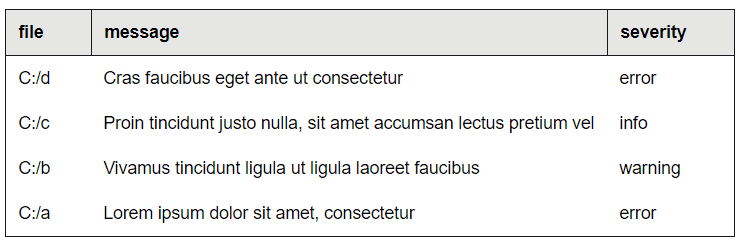

# Solid SimpleTable


Solid SimpleTable is a blazing fast reactive table component that gives you freedom.

### Features

- Very fast as it is compiled down to VanilaJS using Solid
- Very small (~2.7KB)
- Automatic sorting
- Support for custom header and row renderers (so the cells can be components themselves)
- Support for custom sort functions
- Support for onClick on all rows
- Support for DOM accessors
- The library is fully tested with 90% of code coverage.



## Installation

      npm install --save solid-simple-table

## Usage

[**Run demo here!**](https://aminya.github.io/solid-simple-table/)

```js
import { render } from "solid-js/web"

import { SimpleTable } from "solid-simple-table"
import type { SortDirection } from "solid-simple-table"

const rows = [
  { file: "C:/a", message: "Lorem ipsum dolor sit amet, consectetur", severity: "error" },
  { file: "C:/b", message: "Vivamus tincidunt ligula ut ligula laoreet faucibus", severity: "warning" },
  { file: "C:/c", message: "Proin tincidunt justo nulla, sit amet accumsan lectus pretium vel", severity: "info" },
  { file: "C:/d", message: "Cras faucibus eget ante ut consectetur", severity: "error" },
]

function MyTable() {
  return <SimpleTable rows={rows} />
}

render(() => <MyTable />, document.getElementById("app"))
```

The css is available under `dist/SimpleTable.css` which you can import into HTML:

```html
<link rel="stylesheet" href="simple-solid-table/dist/SimpleTable.css" />
```

or in JavaScript:

```js
impost 'simple-solid-table/dist/SimpleTable.css'
```

For other examples, see [the demo folder](https://github.com/aminya/solid-simple-table/tree/master/demo).

## API

```ts

<SimpleTable
  // rows
  rows: Array<Row>

  // Optional props:

  // columns

  // manually provided columns
  columns?: Array<Column<K>>

  /**
    if columns is not provided and Row is an object, construct columns based on this row
    Takes this Row's keys as Column IDs
    @default 0 (first row)
  */
  representitiveRowNumber?: number

  // renderers
  headerRenderer?(column: Column): string | Renderable
  bodyRenderer?(row: Row, columnID: K): string | Renderable

  // styles
  style?: JSX.CSSProperties | string
  className?: string

  // sort options
  defaultSortDirection?: NonNullSortDirection<K>
  rowSorter?(rows: Array<Row>, sortDirection: NonNullSortDirection<K>): Array<Row>


  // accessors

  /**
    set to true if you want column, row, and cell accessors
    @default false
  */
  accessors?: boolean

  /** a function that takes row and returns string unique key for that row
    @default {defaultGetRowID}
  */
  getRowID?(row: Row): string

/>;
```

In which:

```ts
// util types
export type Renderable = any
export type IndexType = string | number

// row and column types
export type Row = number | string | Record<IndexType, any>
export type Column<K extends IndexType = IndexType> = {
  id: K
  label?: string
  sortable?: boolean
  onClick?(e: MouseEvent, row: Row): void
}

/**
 * Sort direction. It is a tuple:
 *
 * @type is The direction of the sort
 * @columnID is the key used for sorting
 */
export type NonNullSortDirection<K extends IndexType = IndexType> = [columnID: K, type: "asc" | "desc"]
export type SortDirection<K extends IndexType = IndexType> = NonNullSortDirection<K> | [columnID: null, type: null]
```

## Projects using Solid-Table

- [Atom's Linter](https://github.com/steelbrain/linter-ui-default)

## License

This package is licensed under the terms of MIT License. Originally, it was inspired by [sb-react-table](https://github.com/steelbrain/react-table/tree/2f8472960a77ca6cf2444c392697772716195bf4).
